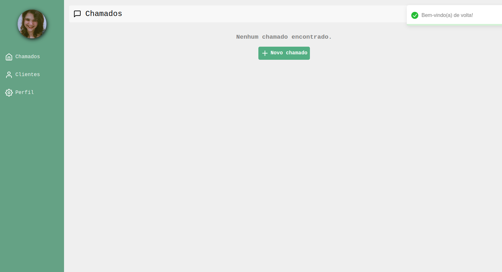

# Helpus

## Autoria de **Bianka Vasconcelos Maciel**

Olá! Seja Bem Vindo ao **Projeto Helpus**, um sistema de abertura de chamados e criação de clientes =D

### Pré-requisitos

- **Node.js** (versão 14 ou superior)
- **npm**

## Como Executar

Para executar o projeto, basta rodar os seguintes comandos:

1. `npm install`: para instalar as dependências do projeto
2. `npm start`: para inicializar a aplicação

Com isso, a aplicação iniciará na url ` http://localhost:3000`

## Páginas do Projeto

### Autenticação

- **Login**: 
- **Cadastro**: 

### Perfil

- **Perfil do Usuário**: 

### Gerenciamento de Clientes

- **Lista de Clientes**: 
- **Criar Cliente**: 
- **Sem Clientes**: 

### Gerenciamento de Chamados

- **Lista de Chamados**: 
- **Criar Chamado**: 
- **Sem Chamados**: 
